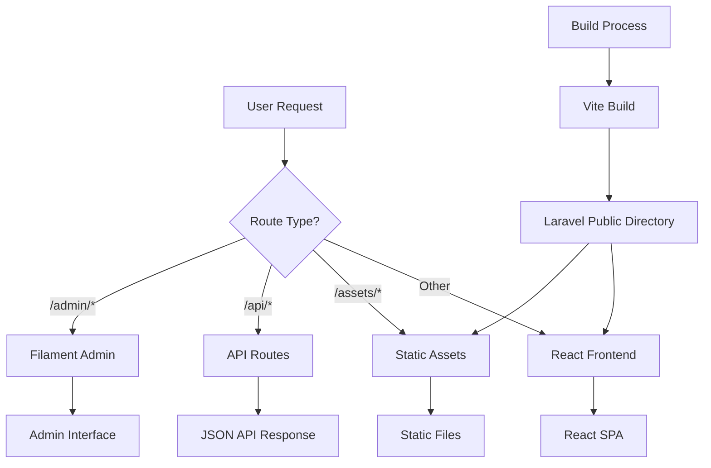

# Design Document

## Overview

This design outlines a seamless integration between the Laravel backend and React frontend systems. The solution ensures that the React application is properly served through the Laravel backend while maintaining clean separation of concerns, efficient routing, and optimal performance for both development and production environments.

## Architecture

### High-Level Architecture



### Request Flow Priority

1. **Admin Routes** (`/admin/*`) - Highest priority for Filament admin interface
2. **API Routes** (`/api/*`) - Second priority for backend API endpoints
3. **Static Assets** (`/assets/*`, specific files) - Third priority for built assets
4. **Frontend Fallback** - Lowest priority, serves React SPA for all other routes

## Components and Interfaces

### 1. Build Integration Component

**Purpose:** Integrate Vite build process with Laravel public directory

**Key Features:**
- Configure Vite to output directly to `backend/public/`
- Maintain asset integrity and proper file structure
- Support both development and production builds

**Configuration Changes:**
```javascript
// vite.config.js modifications
export default defineConfig({
  build: {
    outDir: './backend/public',
    emptyOutDir: false, // Preserve Laravel's index.php
    rollupOptions: {
      input: {
        main: './index.html'
      }
    }
  }
})
```

### 2. Laravel Route Handler Component

**Purpose:** Manage request routing with proper priority and fallback logic

**Key Features:**
- Route prioritization system
- Static file serving with proper headers
- Frontend fallback for SPA routing
- Error handling and logging

**Route Structure:**
```php
// Priority 1: Admin routes (already handled by admin.php)
// Priority 2: API routes (already handled by api.php)
// Priority 3: Static assets
Route::get('/assets/{path}', [StaticFileController::class, 'serveAsset'])
// Priority 4: Specific static files
Route::get('/{file}', [StaticFileController::class, 'serveStaticFile'])
// Priority 5: Frontend fallback
Route::fallback([FrontendController::class, 'serveFrontend'])
```

### 3. Static File Controller

**Purpose:** Handle static asset serving with optimization

**Key Features:**
- MIME type detection
- Cache header management
- Compression support
- Security validation

**Interface:**
```php
class StaticFileController extends Controller
{
    public function serveAsset(string $path): Response
    public function serveStaticFile(string $file): Response
    private function validatePath(string $path): bool
    private function getMimeType(string $path): string
    private function setCacheHeaders(Response $response): Response
}
```

### 4. Frontend Controller

**Purpose:** Serve React application with proper SPA support

**Key Features:**
- Index.html serving for SPA routes
- Route exclusion logic (admin/api)
- Development vs production handling
- Error fallback

**Interface:**
```php
class FrontendController extends Controller
{
    public function serveFrontend(Request $request): Response
    private function shouldServeFrontend(Request $request): bool
    private function getFrontendResponse(): Response
}
```

### 5. Build Script Integration

**Purpose:** Automate the build and deployment process

**Key Features:**
- Pre-build cleanup
- Post-build verification
- Environment-specific builds
- Asset optimization

## Data Models

### Build Configuration Model

```javascript
// Build configuration structure
{
  environment: 'development' | 'production',
  outputPath: './backend/public',
  assetPath: '/assets/',
  publicFiles: ['robots.txt', 'sitemap.xml', 'llms.txt'],
  excludePatterns: ['index.php', '.htaccess']
}
```

### Route Configuration Model

```php
// Route priority configuration
[
    'admin' => ['prefix' => 'admin/', 'priority' => 1],
    'api' => ['prefix' => 'api/', 'priority' => 2],
    'assets' => ['prefix' => 'assets/', 'priority' => 3],
    'static' => ['files' => ['robots.txt', 'sitemap.xml'], 'priority' => 4],
    'frontend' => ['fallback' => true, 'priority' => 5]
]
```

## Error Handling

### Build Process Errors

1. **Missing Dependencies:** Clear error messages with installation instructions
2. **Build Failures:** Detailed error logging with file and line information
3. **Output Directory Issues:** Permission and path validation

### Runtime Errors

1. **Missing Frontend Build:** Graceful fallback with API response
2. **Static File Not Found:** Proper 404 responses
3. **Route Conflicts:** Clear priority-based resolution

### Error Response Format

```php
// API Error Response
{
    "success": false,
    "message": "Human-readable error message",
    "error_code": "SPECIFIC_ERROR_CODE",
    "details": {} // Additional context when appropriate
}

// Frontend Fallback Error
{
    "message": "Frontend build not found",
    "status": "error",
    "suggestion": "Run 'npm run build' to generate frontend assets"
}
```

## Testing Strategy

### Unit Tests

1. **Route Resolution Tests**
   - Test route priority logic
   - Verify admin/API route exclusion
   - Validate static file serving

2. **Controller Tests**
   - Static file controller functionality
   - Frontend controller SPA handling
   - Error response formatting

3. **Build Integration Tests**
   - Vite configuration validation
   - Output directory structure
   - Asset integrity verification

### Integration Tests

1. **End-to-End Route Testing**
   - Full request flow validation
   - Cross-environment compatibility
   - Performance benchmarking

2. **Build Process Testing**
   - Development build validation
   - Production build optimization
   - Asset serving verification

### Performance Tests

1. **Static Asset Serving**
   - Cache header effectiveness
   - Compression ratio testing
   - Load time optimization

2. **Frontend Loading**
   - Initial page load performance
   - Asset loading optimization
   - SPA navigation speed

## Security Considerations

### Path Traversal Protection

- Validate all file paths to prevent directory traversal attacks
- Whitelist allowed file extensions for static assets
- Sanitize user input in route parameters

### Asset Integrity

- Implement content security policy headers
- Use secure file serving practices
- Validate MIME types before serving

### Environment Separation

- Ensure production builds don't expose development tools
- Separate configuration for different environments
- Secure API endpoint access

## Performance Optimization

### Caching Strategy

1. **Static Assets:** Long-term caching with versioned filenames
2. **Frontend HTML:** Short-term caching with validation
3. **API Responses:** Appropriate cache headers based on content

### Asset Optimization

1. **Build-time Optimization:** Minification, tree-shaking, code splitting
2. **Runtime Optimization:** Compression, proper MIME types
3. **Network Optimization:** HTTP/2 support, asset preloading

### Development Experience

1. **Hot Module Replacement:** Fast development iteration
2. **Source Maps:** Debugging support in development
3. **Build Feedback:** Clear progress and error reporting