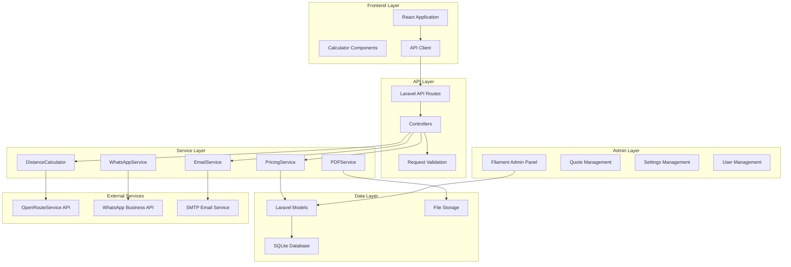

# Design Document

## Overview

This design document outlines the architecture for enhancing the existing YLA Umzug React application with a comprehensive Laravel backend while preserving all frontend functionality. The solution provides a production-ready moving services platform with advanced admin capabilities, API integration, and professional service management.

The design follows a modular architecture with clear separation of concerns, ensuring maintainability, scalability, and seamless integration with the existing React frontend.

## Architecture

### System Architecture Diagram



### Technology Stack

- **Backend Framework**: Laravel 10
- **Admin Panel**: Filament v3 with German localization
- **Database**: SQLite (development/staging), MySQL (production ready)
- **API**: RESTful JSON API with CORS support
- **Email**: Laravel Mail with queue support
- **PDF Generation**: DomPDF
- **Distance Calculation**: OpenRouteService API
- **WhatsApp**: Meta WhatsApp Business API
- **Caching**: File-based caching with Redis support
- **Queue System**: Database queues with Redis support

## Components and Interfaces

### 1. Database Schema Design

#### Core Tables

```sql
-- Quote Requests (Enhanced from existing)
CREATE TABLE quote_requests (
    id BIGINT UNSIGNED AUTO_INCREMENT PRIMARY KEY,
    angebotsnummer VARCHAR(50) UNIQUE NOT NULL, -- QR-2025-001 format
    
    -- Customer Information
    name VARCHAR(255) NOT NULL,
    email VARCHAR(255) NOT NULL,
    telefon VARCHAR(50),
    bevorzugter_kontakt ENUM('email', 'phone', 'whatsapp') DEFAULT 'email',
    
    -- Moving Details
    from_address TEXT NOT NULL,
    to_address TEXT NOT NULL,
    from_postal_code VARCHAR(10),
    to_postal_code VARCHAR(10),
    distance_km DECIMAL(8,2) NULL,
    moving_date DATE NOT NULL,
    moving_type ENUM('local', 'long_distance', 'international') DEFAULT 'local',
    
    -- Services & Pricing
    ausgewaehlte_services JSON, -- ['umzug', 'putzservice', 'entruempelung']
    service_details JSON, -- Detailed service configuration
    estimated_total DECIMAL(10,2),
    endgueltiger_angebotsbetrag DECIMAL(10,2) NULL,
    
    -- Status & Workflow
    status ENUM('pending', 'reviewed', 'quoted', 'accepted', 'rejected', 'completed') DEFAULT 'pending',
    
    -- Additional Information
    special_requirements TEXT,
    admin_notizen TEXT,
    
    -- Email Tracking
    email_sent_at TIMESTAMP NULL,
    whatsapp_sent_at TIMESTAMP NULL,
    
    -- Metadata
    submitted_at TIMESTAMP DEFAULT CURRENT_TIMESTAMP,
    created_at TIMESTAMP DEFAULT CURRENT_TIMESTAMP,
    updated_at TIMESTAMP DEFAULT CURRENT_TIMESTAMP ON UPDATE CURRENT_TIMESTAMP,
    
    INDEX idx_angebotsnummer (angebotsnummer),
    INDEX idx_email (email),
    INDEX idx_status (status),
    INDEX idx_moving_date (moving_date)
);

-- Services Configuration
CREATE TABLE services (
    id BIGINT UNSIGNED AUTO_INCREMENT PRIMARY KEY,
    name VARCHAR(100) NOT NULL,
    slug VARCHAR(100) UNIQUE NOT NULL,
    description TEXT,
    base_price DECIMAL(10,2) DEFAULT 0,
    price_per_unit DECIMAL(10,2) DEFAULT 0,
    unit_type ENUM('hour', 'room', 'sqm', 'item', 'fixed') DEFAULT 'hour',
    is_active BOOLEAN DEFAULT TRUE,
    sort_order INT DEFAULT 0,
    pricing_config JSON, -- Flexible pricing configuration
    created_at TIMESTAMP DEFAULT CURRENT_TIMESTAMP,
    updated_at TIMESTAMP DEFAULT CURRENT_TIMESTAMP ON UPDATE CURRENT_TIMESTAMP
);

-- Settings Management
CREATE TABLE settings (
    id BIGINT UNSIGNED AUTO_INCREMENT PRIMARY KEY,
    group_name VARCHAR(100) NOT NULL,
    key_name VARCHAR(100) NOT NULL,
    value TEXT,
    type ENUM('string', 'integer', 'decimal', 'boolean', 'json') DEFAULT 'string',
    description TEXT,
    is_public BOOLEAN DEFAULT FALSE,
    created_at TIMESTAMP DEFAULT CURRENT_TIMESTAMP,
    updated_at TIMESTAMP DEFAULT CURRENT_TIMESTAMP ON UPDATE CURRENT_TIMESTAMP,
    
    UNIQUE KEY unique_setting (group_name, key_name),
    INDEX idx_group (group_name),
    INDEX idx_public (is_public)
);

-- Users & Authentication
CREATE TABLE users (
    id BIGINT UNSIGNED AUTO_INCREMENT PRIMARY KEY,
    name VARCHAR(255) NOT NULL,
    email VARCHAR(255) UNIQUE NOT NULL,
    email_verified_at TIMESTAMP NULL,
    password VARCHAR(255) NOT NULL,
    role ENUM('admin', 'manager', 'employee') DEFAULT 'employee',
    is_active BOOLEAN DEFAULT TRUE,
    last_login_at TIMESTAMP NULL,
    remember_token VARCHAR(100),
    created_at TIMESTAMP DEFAULT CURRENT_TIMESTAMP,
    updated_at TIMESTAMP DEFAULT CURRENT_TIMESTAMP ON UPDATE CURRENT_TIMESTAMP
);
```

### 2. API Interface Design

#### Calculator API Endpoints

```php
// POST /api/calculator/calculate
{
    "selectedServices": ["umzug", "putzservice"],
    "movingDetails": {
        "rooms": 3,
        "fromAddress": {...},
        "toAddress": {...}
    },
    "cleaningDetails": {
        "objectType": "apartment",
        "size": "3-rooms"
    },
    "generalInfo": {
        "urgency": "normal"
    }
}

// Response
{
    "success": true,
    "pricing": {
        "total": 850.00,
        "breakdown": [
            {
                "service": "Umzug",
                "cost": 650.00,
                "details": ["3 Zimmer", "Lokaler Umzug", "Standard-Service"]
            },
            {
                "service": "Putzservice",
                "cost": 200.00,
                "details": ["3 Zimmer", "Grundreinigung"]
            }
        ],
        "currency": "EUR",
        "disclaimer": "Unverbindliche Schätzung..."
    }
}
```

#### Quote API Endpoints

```php
// POST /api/quotes/submit
{
    "name": "Max Mustermann",
    "email": "max@example.com",
    "phone": "+49 1575 0693353",
    "preferredDate": "2025-02-15",
    "preferredContact": "email",
    "message": "Besondere Anforderungen...",
    "selectedServices": ["umzug"],
    "movingDetails": {...},
    "pricing": {...}
}

// Response
{
    "success": true,
    "message": "Ihre Anfrage wurde erfolgreich gesendet...",
    "data": {
        "angebotsnummer": "QR-2025-001",
        "estimated_total": 650.00
    }
}
```

### 3. Service Layer Architecture

#### PriceCalculatorInterface

```php
interface PriceCalculatorInterface
{
    public function calculate(array $quoteData): float;
    public function getBreakdown(array $quoteData): array;
    public function validateData(array $data): array;
}
```

#### DistanceCalculatorInterface

```php
interface DistanceCalculatorInterface
{
    public function calculateDistance(string $fromPostalCode, string $toPostalCode): array;
    public function geocodePostalCode(string $postalCode): array;
}
```

#### Service Implementation Structure

```php
// PriceCalculator Service
class PriceCalculator implements PriceCalculatorInterface
{
    public function __construct(
        private DistanceCalculatorInterface $distanceCalculator,
        private MovingPriceCalculator $movingCalculator,
        private CleaningPriceCalculator $cleaningCalculator,
        private DeclutterPriceCalculator $declutterCalculator
    ) {}
    
    public function calculate(array $quoteData): float
    {
        // Orchestrate specialized calculators
        // Apply distance-based pricing
        // Handle combination discounts
        // Return total price
    }
}
```

### 4. Filament Admin Panel Design

#### Resource Structure

```php
// QuoteRequestResource
class QuoteRequestResource extends Resource
{
    // German localization
    protected static ?string $navigationLabel = 'Angebotsanfragen';
    protected static ?string $modelLabel = 'Angebotsanfrage';
    
    // Form sections:
    // - Angebotsinformationen (Quote info)
    // - Kundeninformationen (Customer info)
    // - Umzug Details (Moving details)
    // - Services & Preise (Services & pricing)
    // - Zusätzliche Informationen (Additional info)
    
    // Table columns:
    // - angebotsnummer, name, email, status, moving_date
    // - estimated_total, endgueltiger_angebotsbetrag
    
    // Actions:
    // - mark_quoted (Create quote)
    // - calculate_distance (Calculate distance)
    // - send_whatsapp (Send WhatsApp)
    // - generate_pdf (Generate PDF)
}
```

#### Dashboard Widgets

```php
// Quote Statistics Widget
class QuoteStatsWidget extends StatsOverviewWidget
{
    protected function getStats(): array
    {
        return [
            Stat::make('Pending Quotes', QuoteRequest::pending()->count()),
            Stat::make('This Month', QuoteRequest::thisMonth()->count()),
            Stat::make('Conversion Rate', $this->getConversionRate() . '%'),
            Stat::make('Avg. Quote Value', '€' . $this->getAverageValue()),
        ];
    }
}
```

### 5. WhatsApp Integration Design

#### WhatsApp Service Architecture

```php
class WhatsAppService
{
    public function __construct(
        private Client $httpClient,
        private string $accessToken,
        private string $phoneNumberId,
        private string $businessNumber
    ) {}
    
    public function sendQuoteMessage(QuoteRequest $quote): array
    {
        // Send template message with quote details
        // Handle phone number formatting
        // Log message status
        // Return success/failure result
    }
    
    public function sendQuoteDocument(QuoteRequest $quote, string $pdfContent): array
    {
        // Upload PDF to WhatsApp
        // Send document message
        // Include caption with quote details
        // Return message ID and status
    }
}
```

#### Template Configuration

```yaml
# WhatsApp Business Templates
quote_ready_de:
  category: UTILITY
  language: de
  header: "🏠 Ihr Angebot {{1}} ist bereit!"
  body: |
    Hallo {{1}},
    
    Ihr Umzugsangebot ist fertig erstellt!
    
    💰 Gesamtbetrag: {{2}}
    📅 Umzugsdatum: {{3}}
    
    Das detaillierte Angebot als PDF folgt in der nächsten Nachricht.
  footer: "YLA Umzug - Ihr zuverlässiger Partner"
  buttons:
    - type: PHONE_NUMBER
      text: "Anrufen"
      phone_number: "+49 1575 0693353"
    - type: URL
      text: "Website"
      url: "https://yla-umzug.de"
```

## Data Models

### 1. Enhanced QuoteRequest Model

```php
class QuoteRequest extends Model
{
    // Auto-generate quote numbers
    protected static function boot()
    {
        parent::boot();
        static::creating(function ($model) {
            if (empty($model->angebotsnummer)) {
                $model->angebotsnummer = self::generateQuoteNumber();
            }
        });
    }
    
    // Business logic methods
    public function markAsQuoted(float $amount, ?string $notes = null): void;
    public function calculateEstimatedPrice(): float;
    public function sendWhatsAppQuote(): array;
    
    // Relationships
    public function services(): BelongsToMany;
    public function emailLogs(): HasMany;
    
    // Scopes
    public function scopePending($query);
    public function scopeRecent($query, int $days = 30);
    public function scopeByService($query, string $service);
}
```

### 2. Service Model

```php
class Service extends Model
{
    protected $casts = [
        'pricing_config' => 'array',
        'is_active' => 'boolean',
        'base_price' => 'decimal:2',
        'price_per_unit' => 'decimal:2',
    ];
    
    // Relationships
    public function quoteRequests(): BelongsToMany;
    
    // Business logic
    public function calculatePrice(array $details): float;
    public function isAvailable(): bool;
}
```

### 3. Setting Model

```php
class Setting extends Model
{
    // Static helper methods
    public static function getValue(string $key, $default = null);
    public static function setValue(string $key, $value): void;
    public static function getGroup(string $group): Collection;
    
    // Type casting
    public function getCastedValue();
    public function setCastedValue($value): void;
}
```

## Error Handling

### 1. API Error Response Format

```php
// Standardized error response
{
    "success": false,
    "message": "User-friendly error message in German",
    "error_code": "VALIDATION_FAILED",
    "errors": {
        "email": ["E-Mail-Adresse ist erforderlich"],
        "phone": ["Telefonnummer ist ungültig"]
    },
    "debug_info": { // Only in development
        "exception": "ValidationException",
        "file": "/path/to/file.php",
        "line": 123
    }
}
```

### 2. Error Handling Strategy

```php
// Global exception handler
class Handler extends ExceptionHandler
{
    public function render($request, Throwable $exception)
    {
        if ($request->expectsJson()) {
            return $this->handleApiException($exception);
        }
        
        return parent::render($request, $exception);
    }
    
    private function handleApiException(Throwable $exception): JsonResponse
    {
        // Convert exceptions to user-friendly German messages
        // Log errors appropriately
        // Return standardized error format
    }
}
```

### 3. Validation Error Handling

```php
// Custom form request with German messages
class SubmitQuoteRequest extends FormRequest
{
    public function messages(): array
    {
        return [
            'name.required' => 'Name ist erforderlich',
            'email.required' => 'E-Mail ist erforderlich',
            'email.email' => 'Gültige E-Mail-Adresse erforderlich',
            'moving_date.required' => 'Umzugsdatum ist erforderlich',
            'moving_date.after' => 'Umzugsdatum muss in der Zukunft liegen',
        ];
    }
}
```

## Testing Strategy

### 1. Unit Testing

```php
// Service layer testing
class PriceCalculatorTest extends TestCase
{
    public function test_calculates_moving_price_correctly()
    {
        $calculator = new PriceCalculator();
        $result = $calculator->calculate([
            'selectedServices' => ['umzug'],
            'movingDetails' => ['rooms' => 3, 'floors' => 2]
        ]);
        
        $this->assertEquals(650.00, $result);
    }
}

// API endpoint testing
class QuoteApiTest extends TestCase
{
    public function test_submits_quote_successfully()
    {
        $response = $this->postJson('/api/quotes/submit', [
            'name' => 'Test User',
            'email' => 'test@example.com',
            // ... other required fields
        ]);
        
        $response->assertStatus(200)
                ->assertJson(['success' => true]);
    }
}
```

### 2. Feature Testing

```php
// End-to-end workflow testing
class QuoteWorkflowTest extends TestCase
{
    public function test_complete_quote_workflow()
    {
        // 1. Submit quote via API
        // 2. Verify quote created in database
        // 3. Test admin can view quote
        // 4. Test admin can update status
        // 5. Test email notifications sent
        // 6. Test PDF generation works
    }
}
```

### 3. Integration Testing

```php
// External service testing
class DistanceCalculatorTest extends TestCase
{
    public function test_calculates_distance_with_openroute_api()
    {
        $calculator = new OpenRouteServiceCalculator();
        $result = $calculator->calculateDistance('10115', '20095');
        
        $this->assertTrue($result['success']);
        $this->assertGreaterThan(0, $result['distance_km']);
    }
}
```

## Security Considerations

### 1. API Security

- CSRF protection for all state-changing requests
- Rate limiting on API endpoints (60 requests/minute)
- Input validation and sanitization
- SQL injection prevention through Eloquent ORM
- XSS protection through proper output escaping

### 2. Admin Panel Security

- Role-based access control (admin, manager, employee)
- Session-based authentication with secure cookies
- Password hashing using bcrypt
- Activity logging for sensitive operations
- IP-based access restrictions (configurable)

### 3. Data Protection

- Personal data encryption for sensitive fields
- GDPR compliance features (data export, deletion)
- Secure file storage for PDFs and uploads
- Database backup encryption
- Audit trail for data modifications

## Performance Optimization

### 1. Caching Strategy

```php
// Settings caching
Cache::remember('settings.pricing', 3600, function () {
    return Setting::where('group_name', 'pricing')->get();
});

// Distance calculation caching
Cache::remember("distance_{$from}_{$to}", 3600, function () use ($from, $to) {
    return $this->distanceCalculator->calculate($from, $to);
});
```

### 2. Database Optimization

- Proper indexing on frequently queried columns
- Query optimization using Eloquent relationships
- Database connection pooling
- Pagination for large datasets
- Soft deletes for data retention

### 3. Queue Processing

```php
// Email queue processing
class SendQuoteEmailsJob implements ShouldQueue
{
    public function handle()
    {
        // Process email sending in background
        // Retry failed emails with exponential backoff
        // Log email delivery status
    }
}
```

## Deployment Architecture

### 1. Environment Configuration

```env
# Production environment variables
APP_ENV=production
APP_DEBUG=false
APP_URL=https://yla-umzug.de

# Database
DB_CONNECTION=mysql
DB_HOST=localhost
DB_DATABASE=yla_umzug
DB_USERNAME=yla_user
DB_PASSWORD=secure_password

# Email
MAIL_MAILER=smtp
MAIL_HOST=smtp.example.com
MAIL_PORT=587
MAIL_USERNAME=noreply@yla-umzug.de
MAIL_PASSWORD=email_password

# External APIs
OPENROUTE_API_KEY=your_api_key
WHATSAPP_ACCESS_TOKEN=your_token
WHATSAPP_PHONE_NUMBER_ID=your_phone_id

# Queue
QUEUE_CONNECTION=redis
REDIS_HOST=127.0.0.1
REDIS_PASSWORD=redis_password
```

### 2. Server Requirements

- PHP 8.1+
- MySQL 8.0+ or SQLite 3.8+
- Redis (for caching and queues)
- Nginx or Apache
- SSL certificate
- Composer for dependency management

### 3. Deployment Pipeline

```bash
# Automated deployment script
#!/bin/bash
git pull origin main
composer install --no-dev --optimize-autoloader
php artisan migrate --force
php artisan config:cache
php artisan route:cache
php artisan view:cache
php artisan queue:restart
```

This design provides a comprehensive, production-ready Laravel backend that seamlessly integrates with the existing React frontend while adding powerful admin capabilities and professional service management features.