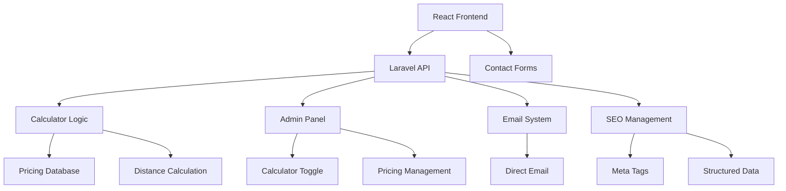

# Design Document

## Overview

The moving cost calculator transforms the existing YLA Umzug website into a streamlined, conversion-focused platform with Laravel backend and React frontend. The design prioritizes simplicity, lead generation, and easy maintenance by junior developers.

The system uses a clean separation: React handles the user interface and calculator interactions, while Laravel manages business logic, pricing data, email handling, and SEO optimization.

## Architecture

### High-Level Architecture



### Simplified Architecture

**Frontend (React/Vite)**
- Calculator UI components
- Contact forms
- Responsive design
- API communication

**Backend (Laravel)**
- Calculator API endpoints
- Admin panel for pricing/settings
- Email handling
- SEO meta tag generation
- Database management

### Component Structure

```
Frontend (React):
src/
├── components/
│   ├── Calculator.jsx          // Main calculator component
│   ├── ContactForm.jsx         // Lead capture form
│   └── PriceDisplay.jsx        // Results display
├── pages/
│   ├── HomePage.jsx            // Existing + calculator integration
│   ├── CalculatorPage.jsx      // Dedicated calculator page
│   └── ContactPage.jsx         // Enhanced contact page
└── lib/
    └── api.js                  // Laravel API communication

Backend (Laravel):
app/
├── Http/Controllers/
│   ├── CalculatorController.php
│   ├── ContactController.php
│   └── Admin/PricingController.php
├── Models/
│   ├── PricingTier.php
│   └── ContactSubmission.php
└── Mail/
    └── ContactInquiry.php
```

## User Experience Flow

### Optimized Conversion Flow

The calculator follows a conversion-optimized flow that minimizes friction and maximizes lead generation:

1. **Service Selection** - User selects needed services (Umzug, Entrümpelung, Putzservice)
2. **Service Details** - Conditional forms based on selected services
3. **Price Calculation** - Display estimated costs with clear breakdown
4. **Contact Information** - Request details only when user wants official quote

This flow ensures users see value (price estimate) before providing personal information, significantly improving conversion rates.

### Step-by-Step Components

```javascript
// Calculator flow with conditional steps
const steps = [
  { id: 'service', title: 'Service wählen', component: ServiceSelection },
  { id: 'moving', title: 'Umzug Details', component: MovingDetails, condition: () => services.includes('umzug') },
  { id: 'cleaning', title: 'Putzservice Details', component: CleaningDetails, condition: () => services.includes('putzservice') },
  { id: 'declutter', title: 'Entrümpelung Details', component: DeclutterDetails, condition: () => services.includes('entruempelung') },
  { id: 'summary', title: 'Kostenübersicht', component: PriceSummary },
  { id: 'contact', title: 'Kontaktdaten', component: GeneralInfo }
];
```

## Components and Interfaces

### Frontend Components (React)

**Calculator Component**
- Simple cost calculation interface
- Communicates with Laravel API
- Shows/hides based on admin toggle

```javascript
interface CalculatorState {
  startAddress: string;
  endAddress: string;
  apartmentSize: string;
  isCalculating: boolean;
  result: PriceResult | null;
}

interface PriceResult {
  totalCost: number;
  breakdown: {
    baseCost: number;
    distanceCost: number;
  };
  currency: string;
}
```

**ContactForm Component**
- Lead capture with calculation data
- Direct email submission to Laravel
- Pre-filled from calculator results

```javascript
interface ContactFormData {
  name: string;
  email: string;
  phone: string;
  message: string;
  calculationData?: PriceResult;
}
```

### Backend Components (Laravel)

**CalculatorController**
- Handles price calculation requests
- Manages calculator enable/disable state
- Returns pricing data from database

**ContactController**
- Processes contact form submissions
- Sends emails directly to business owner
- Stores inquiries for follow-up

**Admin Panel**
- Simple Laravel admin for pricing management
- Calculator toggle functionality
- Basic settings management

## Data Models

### Laravel Database Models

**PricingTier Model**
```php
// Laravel Eloquent Model
class PricingTier extends Model {
    protected $fillable = [
        'apartment_size',
        'base_price',
        'price_per_km',
        'is_active'
    ];
}
```

**ContactSubmission Model**
```php
class ContactSubmission extends Model {
    protected $fillable = [
        'name',
        'email', 
        'phone',
        'message',
        'calculation_data',
        'status'
    ];
    
    protected $casts = [
        'calculation_data' => 'array'
    ];
}
```

**Settings Model**
```php
class Setting extends Model {
    protected $fillable = [
        'key',
        'value',
        'type'
    ];
    
    // For calculator_enabled, base_email, etc.
}
```

### Frontend Interfaces

```javascript
// Simplified data structures for React
interface CalculationRequest {
  startAddress: string;
  endAddress: string;
  apartmentSize: string;
}

interface CalculationResponse {
  success: boolean;
  totalCost: number;
  breakdown: {
    baseCost: number;
    distanceCost: number;
    distance: number;
  };
  currency: string;
}
```

## Error Handling

### Simple Error Strategy

**Frontend (React)**
- Show user-friendly German error messages
- Fallback to contact form if calculator fails
- Basic input validation before API calls

**Backend (Laravel)**
- Laravel's built-in validation and error handling
- Email notifications for system errors
- Graceful API responses with error messages

```javascript
// Simple error handling in React
const handleCalculationError = (error) => {
  if (error.type === 'network') {
    showMessage('Netzwerkfehler. Bitte kontaktieren Sie uns direkt.');
  } else {
    showMessage('Fehler bei der Berechnung. Bitte versuchen Sie es erneut.');
  }
};
```

## Testing Strategy

### Simple Testing Approach

**Manual Testing**
- Test calculator with different inputs
- Verify email delivery works
- Check mobile responsiveness
- Test admin panel functionality

**Basic Automated Testing**
- Laravel feature tests for API endpoints
- Simple React component tests
- Form validation testing

## Performance & SEO

### Performance
- Optimize images and assets
- Use Laravel caching for pricing data
- Minimize JavaScript bundle size
- Fast mobile loading

### SEO (Laravel-managed)
- Proper German meta tags in Laravel views
- Structured data for local business
- Clean URLs and sitemap
- Mobile-first design

## Security

### Basic Security
- Laravel's built-in CSRF protection
- Input validation and sanitization
- Secure email configuration
- Basic rate limiting for forms